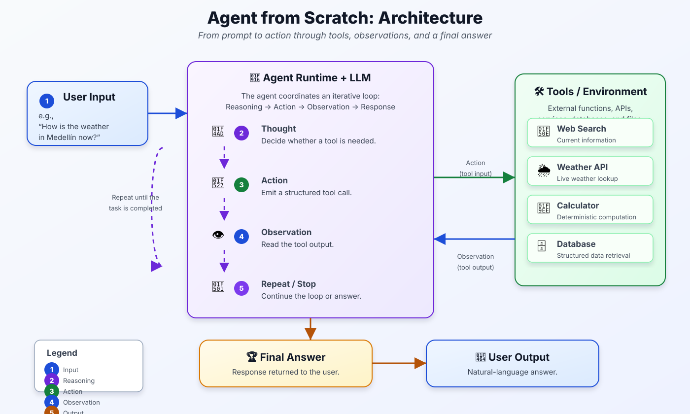
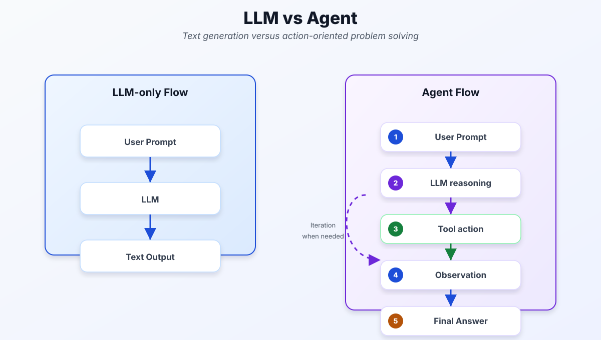
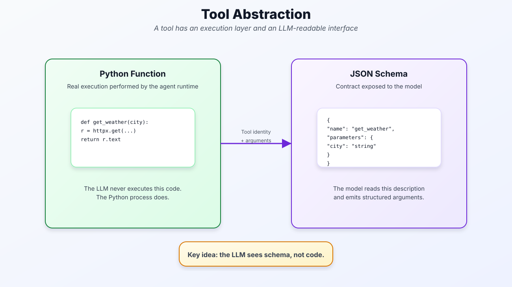
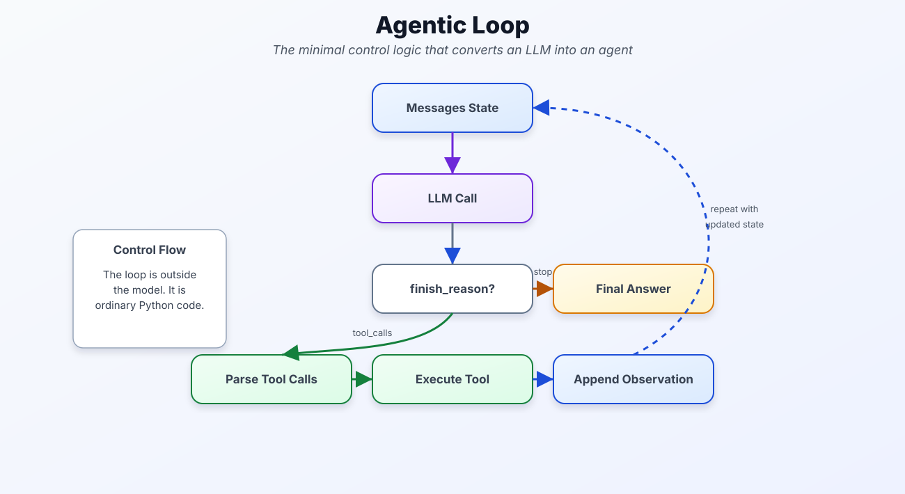
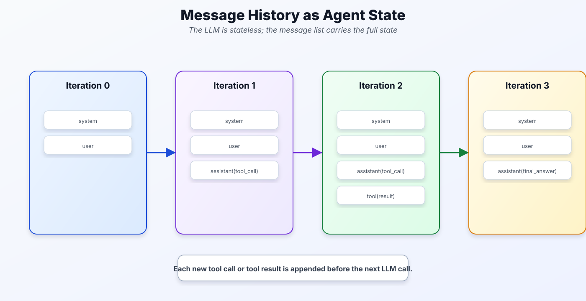
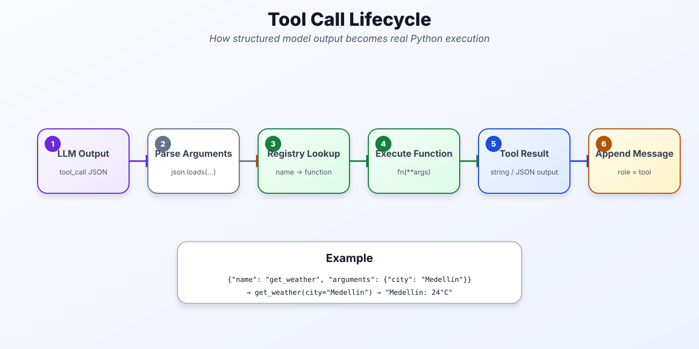
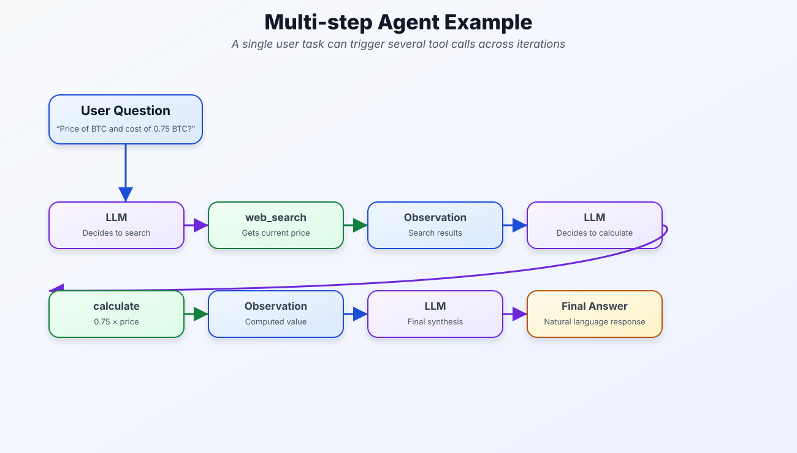

# Construir un agente desde cero: arquitectura, herramientas y el loop agéntico

> Un recorrido visual por los conceptos fundamentales que convierten un modelo de lenguaje en un sistema capaz de actuar sobre el mundo: razonar, llamar herramientas, observar y responder.
>
> **7 figuras · lectura ~12 min**

---

## Contenido

1. [Arquitectura general de un agente](#1-arquitectura-general-de-un-agente)
2. [LLM vs. Agente: ¿cuál es la diferencia real?](#2-llm-vs-agente-cuál-es-la-diferencia-real)
3. [Abstracción de una herramienta: código Python vs. esquema JSON](#3-abstracción-de-una-herramienta-código-python-vs-esquema-json)
4. [El loop agéntico: la lógica de control mínima](#4-el-loop-agéntico-la-lógica-de-control-mínima)
5. [El historial de mensajes como estado del agente](#5-el-historial-de-mensajes-como-estado-del-agente)
6. [Ciclo de vida de una tool call](#6-ciclo-de-vida-de-una-tool-call)
7. [Ejemplo multi-paso: encadenando herramientas](#7-ejemplo-multi-paso-encadenando-herramientas)

---

## 1. Arquitectura general de un agente

Un agente no es un modelo más inteligente; es un *sistema* que rodea al LLM con una infraestructura de herramientas, memoria y un ciclo de control. La figura muestra el flujo completo: el usuario lanza una pregunta, el runtime del agente orquesta al LLM, y ese LLM puede emitir acciones hacia herramientas externas (APIs, bases de datos, calculadoras). Las observaciones vuelven al modelo, que decide si necesita otro paso o tiene suficiente para responder.



> **Idea clave:** el LLM no actúa directamente sobre el mundo; sólo *describe* qué acción quiere realizar. El runtime Python es quien realmente ejecuta esa acción y devuelve el resultado.

---

## 2. LLM vs. Agente: ¿cuál es la diferencia real?

Un LLM solo hace una cosa: dado un prompt, genera texto. El flujo termina ahí. Un agente, en cambio, puede iterar: después de generar texto puede decidir llamar una herramienta, recibir el resultado y seguir razonando. La misma pregunta puede requerir varios ciclos antes de que el modelo tenga suficiente información para responder.

La figura compara ambos flujos lado a lado. El flujo LLM es una línea recta de tres pasos. El flujo agéntico incluye un lazo de retroalimentación: el razonamiento puede derivar en una acción, cuya observación re-alimenta al modelo antes de producir la respuesta final.



> **Idea clave:** lo que convierte al LLM en agente no es un modelo diferente, sino el *loop de control externo* que inspecciona su salida y decide si ejecutar herramientas o entregar la respuesta.

---

## 3. Abstracción de una herramienta: código Python vs. esquema JSON

Una herramienta tiene dos caras. Por un lado, hay una función Python real que ejecuta trabajo de verdad: hace una petición HTTP, consulta una base de datos, realiza un cálculo. Por otro, hay un esquema JSON que describe esa función al modelo: su nombre, sus parámetros y qué hace.

El LLM **sólo ve el esquema**. Nunca ve el código fuente ni lo ejecuta. Lee la descripción, decide que quiere usar esa herramienta, y emite los argumentos en formato estructurado. El runtime Python recibe esos argumentos, invoca la función real, y devuelve el resultado.



> **Idea clave:** esta separación hace los agentes componibles y seguros. El modelo describe *intenciones*, el código Python toma *decisiones de ejecución*. Se puede cambiar la implementación sin re-entrenar el modelo.

---

## 4. El loop agéntico: la lógica de control mínima

El corazón de cualquier agente es un bucle. No es un concepto abstracto: es código Python ordinario. El loop mantiene el estado de mensajes, llama al LLM, examina el `finish_reason` de la respuesta, y bifurca:

- Si el modelo quiere usar una herramienta (`tool_calls`) → la ejecuta y añade la observación al estado.
- Si el modelo quiere terminar (`stop`) → devuelve la respuesta final.



```python
messages = [{"role": "system", "content": SYSTEM}, {"role": "user", "content": user_input}]

while True:
    response = client.messages.create(model=MODEL, tools=TOOLS, messages=messages)

    if response.stop_reason == "end_turn":
        return extract_text(response)                  # respuesta final

    # hay tool_calls → ejecutar y continuar
    messages.append({"role": "assistant", "content": response.content})
    for tool_use in response.content:
        if tool_use.type == "tool_use":
            result = REGISTRY[tool_use.name](**tool_use.input)
            messages.append({"role": "user", "content": [
                {"type": "tool_result", "tool_use_id": tool_use.id, "content": str(result)}
            ]})
```

> **Idea clave:** el loop *no está dentro* del modelo. Es código externo ordinario. El LLM sólo genera texto; la lógica de control es tuya.

---

## 5. El historial de mensajes como estado del agente

El LLM es sin estado (*stateless*): no recuerda nada entre llamadas. La memoria del agente reside en la lista de mensajes que se le envía en cada iteración:

| Iteración | Lista de mensajes |
|-----------|-------------------|
| 0 | `[system, user]` |
| 1 | `[system, user, assistant(tool_call)]` |
| 2 | `[system, user, assistant(tool_call), tool(result)]` |
| 3 | `[system, user, assistant(tool_call), tool(result), assistant(final_answer)]` |



> **Idea clave:** cada tool call y su resultado se añaden a la lista *antes* de la siguiente llamada al LLM. La "memoria" del agente es literalmente esa lista, que crece con cada iteración.

---

## 6. Ciclo de vida de una tool call

Cuando el LLM decide usar una herramienta, emite un bloque JSON estructurado. El proceso que lo recibe tiene que convertir ese JSON en una llamada Python real. Los seis pasos son:

1. **LLM emite** un bloque `tool_call` en JSON
2. **Parsear argumentos** con `json.loads(...)`
3. **Registro** resuelve el nombre a una función: `name → fn`
4. **Ejecutar** `fn(**args)`
5. **Obtener resultado** (string o JSON)
6. **Añadir** al historial con `role = tool`



**Ejemplo concreto:**

```python
# El LLM emite:
{"name": "get_weather", "arguments": {"city": "Medellín"}}

# El runtime ejecuta:
get_weather(city="Medellín")  # → "Medellín: 24°C, parcialmente nublado"

# Y añade al historial:
{"role": "tool", "content": "Medellín: 24°C, parcialmente nublado"}
```

---

## 7. Ejemplo multi-paso: encadenando herramientas

Para cerrar, un ejemplo end-to-end. El usuario pregunta el precio del BTC y cuánto costarían 0.75 BTC. El agente necesita dos herramientas en iteraciones sucesivas:

1. `web_search` → obtiene el precio actual del BTC
2. `calculate` → multiplica `0.75 × precio`
3. LLM sintetiza ambos resultados en lenguaje natural



> **Idea clave:** el agente no construye un plan completo al inicio. En cada iteración, el LLM observa el estado actual de los mensajes y decide el siguiente paso. Es razonamiento incremental, no planificación anticipada.

---

## Resumen: los cinco conceptos fundamentales

| # | Concepto | En una línea |
|---|----------|--------------|
| 1 | **El agente es arquitectura** | LLM + loop de control + herramientas + memoria de mensajes |
| 2 | **El LLM no ejecuta código** | Sólo produce JSON estructurado; el runtime Python hace la ejecución |
| 3 | **Dos caras de una herramienta** | Función Python para el runtime; esquema JSON para el LLM |
| 4 | **Memoria = lista de mensajes** | El LLM es stateless; la conversación completa viaja en cada llamada |
| 5 | **Razonamiento incremental** | El agente decide el siguiente paso en cada iteración, no de antemano |

---


