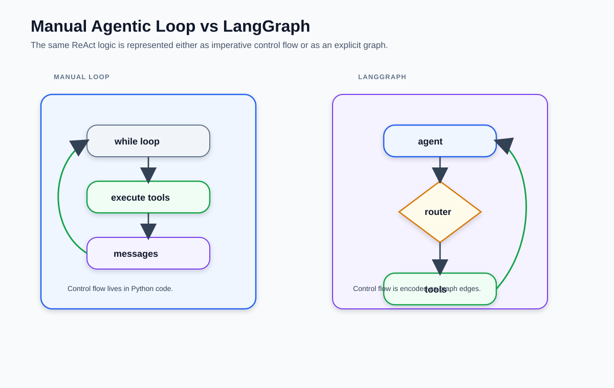
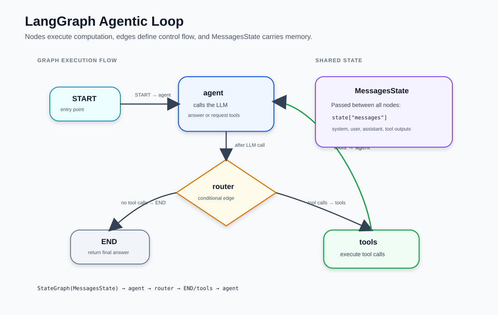
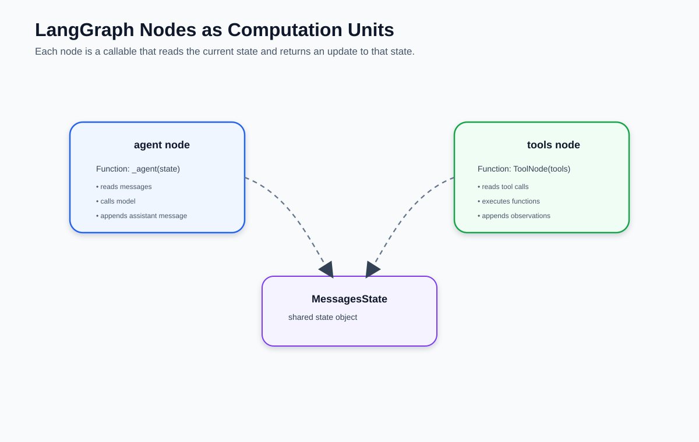
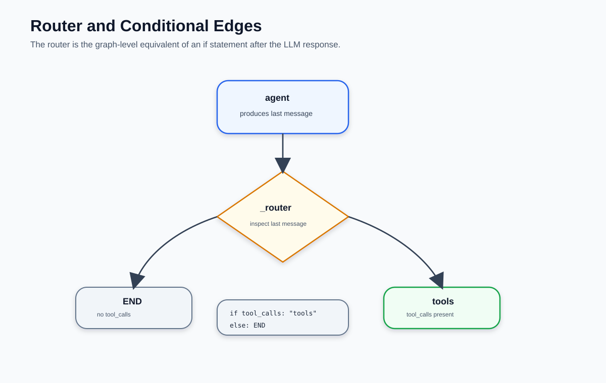
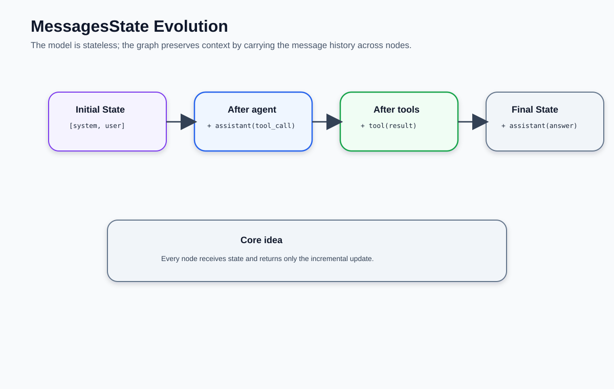
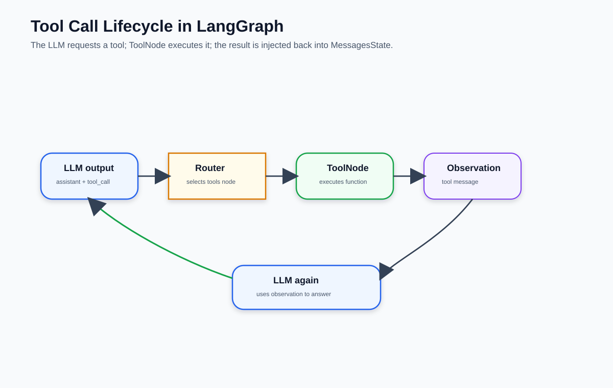
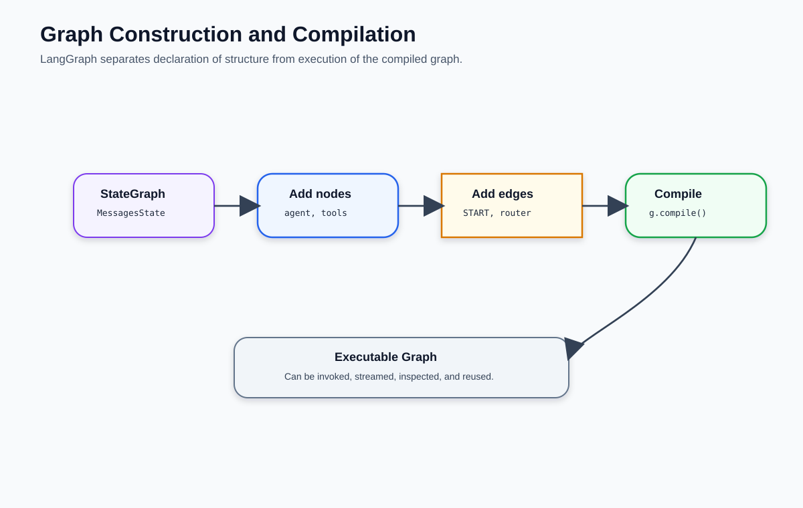
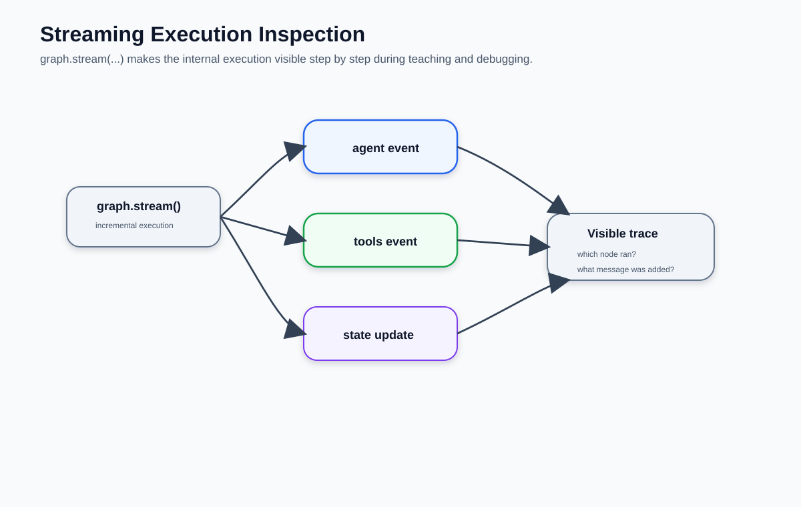
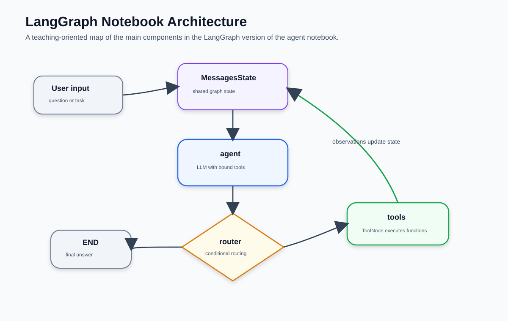

# LangGraph por dentro: nodos, edges, estado y compilación

> El blog anterior mostró *qué* cambia al pasar de un loop manual a LangGraph.
> Este entra en *cómo* funciona LangGraph: qué es un nodo, qué hace el compilador,
> cómo fluye el estado y qué puedes observar en ejecución.
>
> **9 figuras · lectura ~14 min**

---

## Contenido

1. [Loop manual vs LangGraph: la misma lógica, otra representación](#1-loop-manual-vs-langgraph-la-misma-lógica-otra-representación)
2. [El loop agéntico exacto en LangGraph](#2-el-loop-agéntico-exacto-en-langgraph)
3. [Nodos como unidades de cómputo](#3-nodos-como-unidades-de-cómputo)
4. [Router y conditional edges](#4-router-y-conditional-edges)
5. [Evolución del MessagesState](#5-evolución-del-messagesstate)
6. [Ciclo de vida de una tool call en LangGraph](#6-ciclo-de-vida-de-una-tool-call-en-langgraph)
7. [Construcción y compilación del grafo](#7-construcción-y-compilación-del-grafo)
8. [Inspección del grafo con streaming](#8-inspección-del-grafo-con-streaming)
9. [Arquitectura completa del notebook](#9-arquitectura-completa-del-notebook)

---

## 1. Loop manual vs LangGraph: la misma lógica, otra representación

El agentic loop de `part01` y el grafo de `part02` implementan exactamente el mismo patrón ReAct. La diferencia no es en *qué* hacen, sino en *dónde vive el control*.

En el loop manual, el flujo está codificado en Python imperativo: un `for`, un `if/elif`, llamadas a `append`. Si quieres cambiar el comportamiento — añadir un nodo de validación, bifurcar según el tipo de tool — tienes que modificar esa función.

En LangGraph, el flujo está codificado como **edges del grafo**. Cambiar el comportamiento significa añadir o redirigir edges, sin tocar la lógica de los nodos existentes.



> **La intuición clave:** en el loop manual el control flow *está en el código*. En LangGraph el control flow *es la estructura del grafo*. Eso lo hace inspeccionable, visualizable y modificable sin reescribir lógica.

---

## 2. El loop agéntico exacto en LangGraph

Visto desde arriba, el loop agéntico de LangGraph tiene tres actores y dos tipos de conexión:

- **Nodos** — ejecutan cómputo: `agent_node` llama al LLM, `tool_node` ejecuta herramientas
- **Edges** — definen el flujo: `tools → agent` es el ciclo; el edge condicional desde `agent` decide si continuar o terminar
- **`MessagesState`** — el estado compartido que viaja entre todos los nodos, creciendo con cada mensaje nuevo

El ciclo ocurre porque el edge `tools → agent` vuelve incondicionalmente al nodo `agent` después de ejecutar cualquier herramienta. El grafo termina cuando el router devuelve `"__end__"` en lugar de `"tools"`.



> **Límite de iteraciones:** en el loop manual era `range(1, 11)`. En LangGraph se configura con `graph.compile(recursion_limit=10)`. Si se supera, LangGraph lanza `GraphRecursionError` en lugar de retornar silenciosamente.

---

## 3. Nodos como unidades de cómputo

En LangGraph un **nodo** es cualquier callable que recibe el estado actual y devuelve una actualización parcial de ese estado. Nada más.

```python
# agent_node: recibe estado, devuelve nuevo mensaje del LLM
def agent_node(state: MessagesState) -> dict:
    messages = state["messages"]
    if not any(isinstance(m, SystemMessage) for m in messages):
        messages = [SystemMessage(content=SYSTEM_PROMPT)] + messages
    response = llm_with_tools.invoke(messages)
    return {"messages": [response]}   # ← actualización parcial, no reemplazo
```

LangGraph **acumula** las actualizaciones — no reemplaza el estado. Cuando `agent_node` devuelve `{"messages": [response]}`, ese mensaje se *añade* a la lista existente. Es el equivalente del `messages.append(assistant_msg)` de `part01`, pero automático.

`ToolNode` sigue exactamente la misma contrato: recibe el estado, extrae los `tool_calls` del último `AIMessage`, ejecuta las funciones correspondientes, y devuelve `{"messages": [ToolMessage(...), ...]}`.



> **Contratos de los dos nodos del agente:**
>
> | Nodo | Input (del estado) | Output (actualización) |
> |---|---|---|
> | `agent_node` | `state["messages"]` completo | `{"messages": [AIMessage]}` |
> | `ToolNode` | último `AIMessage` con `tool_calls` | `{"messages": [ToolMessage, ...]}` |

---

## 4. Router y conditional edges

El router es la función que reemplaza el `if finish_reason == "tool_calls"` del loop manual. Recibe el estado, inspecciona el último mensaje, y devuelve el nombre del siguiente nodo.

```python
def router(state: MessagesState) -> Literal["tools", "__end__"]:
    last = state["messages"][-1]
    if hasattr(last, "tool_calls") and last.tool_calls:
        return "tools"
    return "__end__"

# Registro en el grafo:
builder.add_conditional_edges("agent", router)
```

`add_conditional_edges` toma el nodo de origen (`"agent"`) y la función de routing. LangGraph evalúa el router *después de cada ejecución de `agent_node`* y enruta el flujo según el string devuelto.



> **Por qué `"__end__"` y no `END`:** `END` es el nodo especial de LangGraph que termina el grafo. `"__end__"` es su nombre como string — ambos son equivalentes. En la práctica, usar `"__end__"` en el router es más legible que importar la constante solo para eso.

---

## 5. Evolución del MessagesState

`MessagesState` es un `TypedDict` con una sola clave: `messages`. Pero tiene una propiedad importante: usa un **reducer** de acumulación. Cuando un nodo devuelve `{"messages": [nuevo]}`, LangGraph no reemplaza la lista — la extiende.

Esto es lo que hace posible que el grafo "recuerde" el historial sin que ningún nodo lo gestione explícitamente:

```
Inicio:       [HumanMessage("precio BTC")]
Tras agent:   [Human, AIMessage(tool_call: web_search)]
Tras tools:   [Human, AI, ToolMessage("BTC: $94,200")]
Tras agent:   [Human, AI, Tool, AIMessage(tool_call: calculate)]
Tras tools:   [Human, AI, Tool, AI, ToolMessage("70,650.0")]
Tras agent:   [Human, AI, Tool, AI, Tool, AIMessage("0.75 BTC costaría $70,650")]
```

Cada nodo solo añade su propio mensaje. Ningún nodo conoce ni gestiona el historial completo — esa es responsabilidad del framework.



> **El LLM sigue siendo stateless.** `MessagesState` no es memoria del modelo — es el historial completo que se envía en cada llamada a `llm_with_tools.invoke(messages)`. La diferencia con `part01` es que ahora LangGraph gestiona ese append automáticamente.

---

## 6. Ciclo de vida de una tool call en LangGraph

Cuando el LLM decide usar una herramienta, emite un `AIMessage` con `tool_calls`. `ToolNode` toma ese mensaje, extrae cada tool call, despacha a la función Python correspondiente, y empaqueta los resultados como `ToolMessage` con el `tool_call_id` correcto.

Todo esto ocurre **dentro del nodo `tools`** — es lo que `ToolNode` abstrae versus el bloque manual de `part01`:

```python
# part01 — manual (dentro del loop)
for tc in assistant_msg.tool_calls:
    tool_name = tc.function.name
    tool_args = json.loads(tc.function.arguments)
    fn = tool_registry.get(tool_name)
    result = fn(**tool_args)
    messages.append({"role": "tool", "tool_call_id": tc.id, "content": result})

# part02 — ToolNode hace todo esto automáticamente
tool_node = ToolNode(TOOLS)
builder.add_node("tools", tool_node)
```

`ToolNode` también maneja tool calls paralelas: si el LLM emite múltiples `tool_calls` en un solo `AIMessage`, `ToolNode` las ejecuta todas y devuelve un `ToolMessage` por cada una.



> **Lo que `ToolNode` abstrae:** el dispatch por nombre (`tool_registry`), el parseo de argumentos (`json.loads`), el empaquetado del resultado (`role: tool`, `tool_call_id`), y el soporte para tool calls paralelas. En `part01` esas ~8 líneas eran explícitas; aquí son una línea.

---

## 7. Construcción y compilación del grafo

LangGraph separa dos fases que en el loop manual eran una sola: **declaración** y **ejecución**.

```python
# Fase 1: declaración — describe la estructura, no ejecuta nada
builder = StateGraph(MessagesState)
builder.add_node("agent", agent_node)
builder.add_node("tools", tool_node)
builder.add_edge(START, "agent")
builder.add_conditional_edges("agent", router)
builder.add_edge("tools", "agent")

# Fase 2: compilación — valida la estructura y produce el runnable
graph = builder.compile()
```

`builder.compile()` valida que el grafo sea coherente (todos los nodos referenciados existen, hay un camino desde `START` hasta `END`, no hay edges huérfanos), genera el plan de ejecución interno, y devuelve un objeto `CompiledGraph` con los métodos `.invoke()`, `.stream()`, y `.get_graph()`.

El grafo compilado es **reutilizable e inmutable** — puedes invocarlo miles de veces. Para cambiar el comportamiento hay que declarar uno nuevo y compilarlo.



> **`recursion_limit`:** el límite de iteraciones se configura en la compilación:
> ```python
> graph = builder.compile(recursion_limit=15)
> ```
> El valor por defecto es 25. Superar el límite lanza `GraphRecursionError`.

---

## 8. Inspección del grafo con streaming

`graph.stream()` hace visible la ejecución nodo a nodo. Con `stream_mode="values"` emite el **estado completo** después de cada nodo; con `stream_mode="updates"` emite solo la **actualización parcial** de ese nodo.

```python
# stream_mode="values" — estado completo tras cada nodo
for step in graph.stream({"messages": [HumanMessage(query)]}, stream_mode="values"):
    last = step["messages"][-1]
    # last es el mensaje más reciente: AIMessage, ToolMessage, o AIMessage final

# stream_mode="updates" — solo el delta de cada nodo
for node_name, update in graph.stream({"messages": [HumanMessage(query)]}, stream_mode="updates"):
    print(f"Nodo: {node_name}")
    print(f"Update: {update}")
```

Para inspeccionar el historial completo al terminar, `graph.invoke()` devuelve el estado final:

```python
final_state = graph.invoke({"messages": [HumanMessage(query)]})
for msg in final_state["messages"]:
    print(type(msg).__name__, ":", str(msg.content)[:100])
```

También puedes visualizar el grafo antes de ejecutarlo:

```python
from IPython.display import Image, display
display(Image(graph.get_graph().draw_mermaid_png()))
```



> **Útil para enseñanza:** `stream_mode="updates"` es ideal para mostrar en clase qué hace cada nodo y en qué orden. Ver `agent → tools → agent → __end__` en tiempo real hace el loop agéntico tangible.

---

## 9. Arquitectura completa del notebook

La figura final muestra todos los componentes del notebook como un mapa de referencia: desde el cliente LLM y las herramientas decoradas con `@tool`, pasando por los nodos y el router, hasta el grafo compilado y los métodos de ejecución e inspección.

Es útil como vista de conjunto para orientarse cuando el código está distribuido en varias celdas.



---

## Resumen conceptual

| Concepto LangGraph | Equivalente en el loop manual |
|---|---|
| `StateGraph(MessagesState)` | La lista `messages` + el `for` loop |
| `agent_node` | El bloque `client.chat.completions.create(...)` |
| `ToolNode(TOOLS)` | El bloque `for tc in tool_calls: fn(**args); append(...)` |
| `router` | El `if finish_reason == "tool_calls"` |
| `add_conditional_edges` | La bifurcación `if/elif/else` |
| `add_edge("tools", "agent")` | El `continue` implícito del loop |
| `builder.compile()` | No existe — el loop siempre está "compilado" |
| `graph.stream(...)` | Instrumentación manual con `print` en cada paso |
| `recursion_limit` | El `range(1, 11)` del `for` |

### Lo que LangGraph añade que el loop manual no tiene

- **Visualización** del grafo como diagrama Mermaid o PNG
- **Streaming nativo** sin instrumentar el loop
- **Validación estructural** en la compilación (detecta grafos rotos antes de ejecutar)
- **Extensibilidad declarativa**: añadir memoria persistente (`MemorySaver`), human-in-the-loop (`interrupt_before`), o subgrafos requiere cambios en la *estructura*, no en la lógica de los nodos

### Próximos pasos

Con esta base, el siguiente notebook introduce dos extensiones del mismo grafo:

- **`MemorySaver`** — memoria persistente entre conversaciones: el historial sobrevive entre llamadas a `graph.invoke()`
- **`interrupt_before`** — human-in-the-loop: el grafo pausa antes de ejecutar `tools` y espera confirmación del usuario

---


