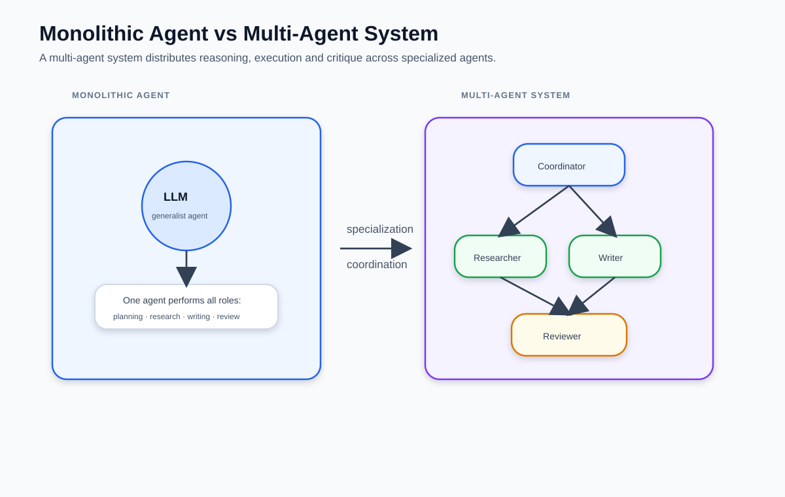
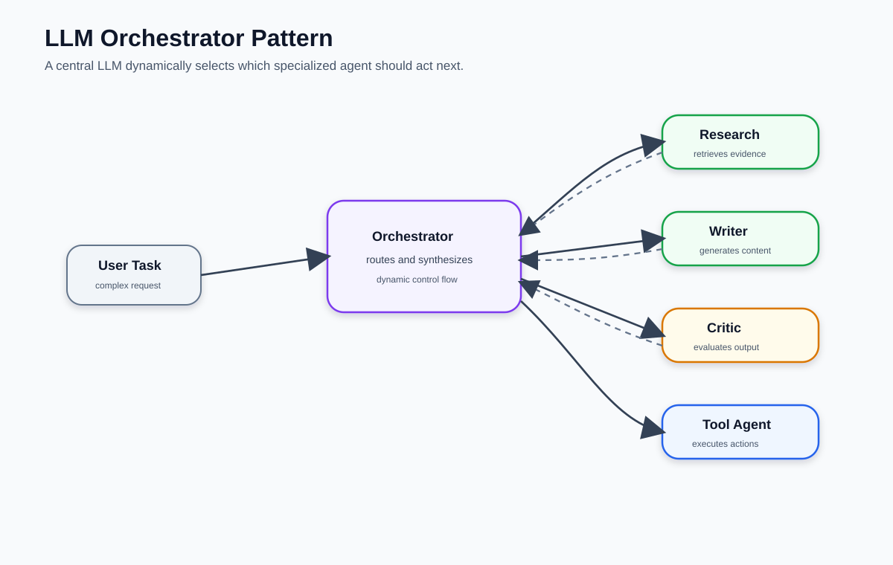
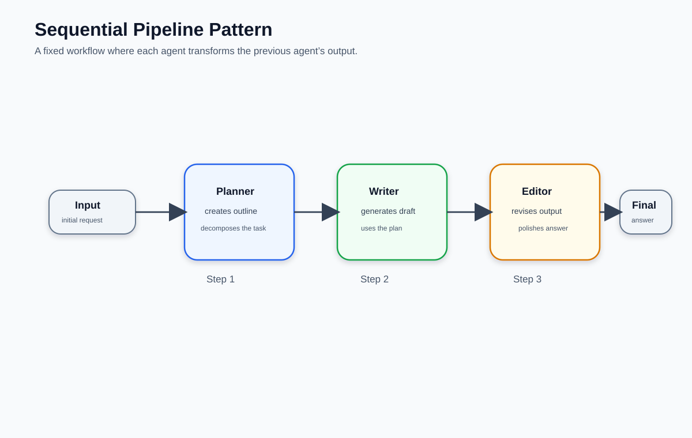
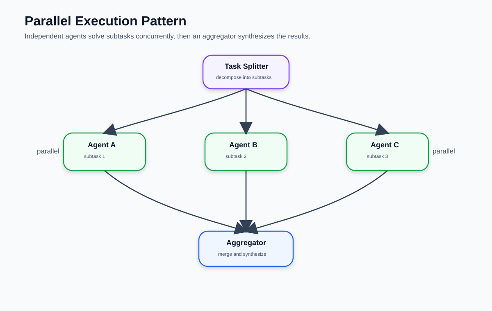
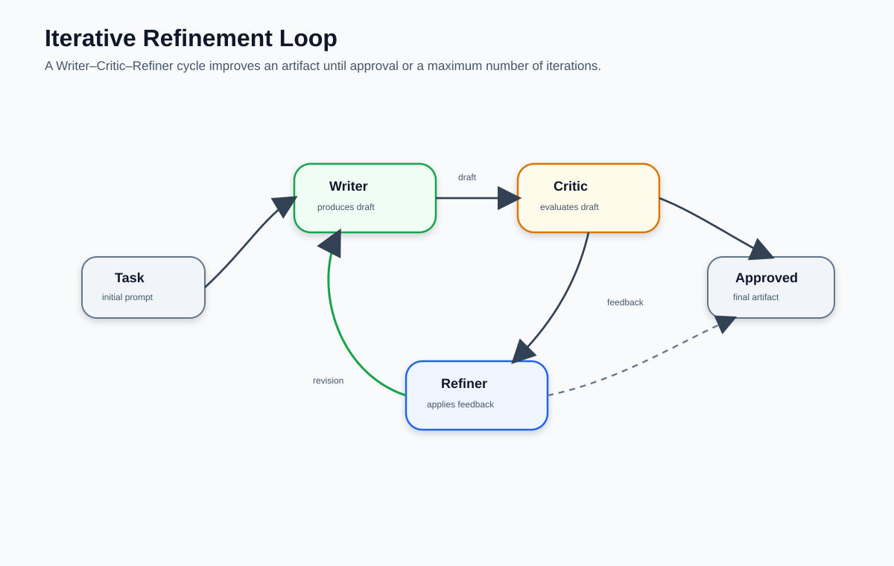
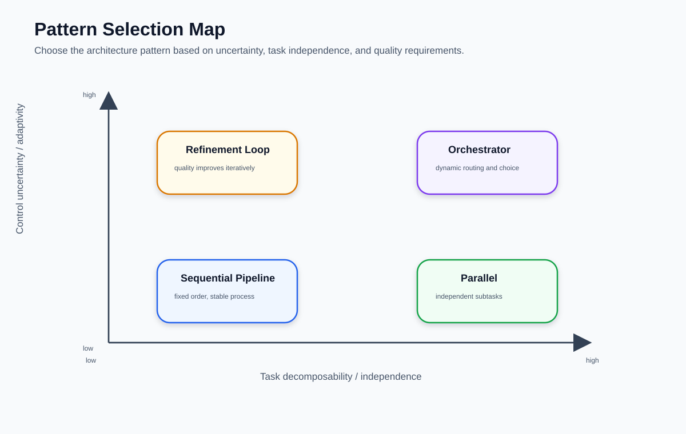
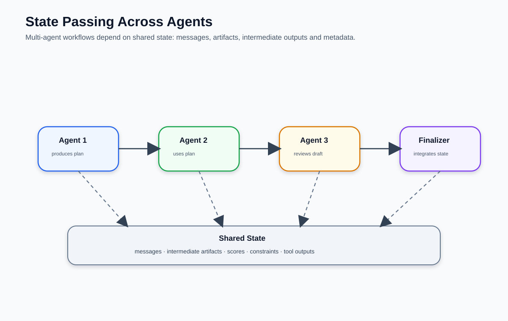
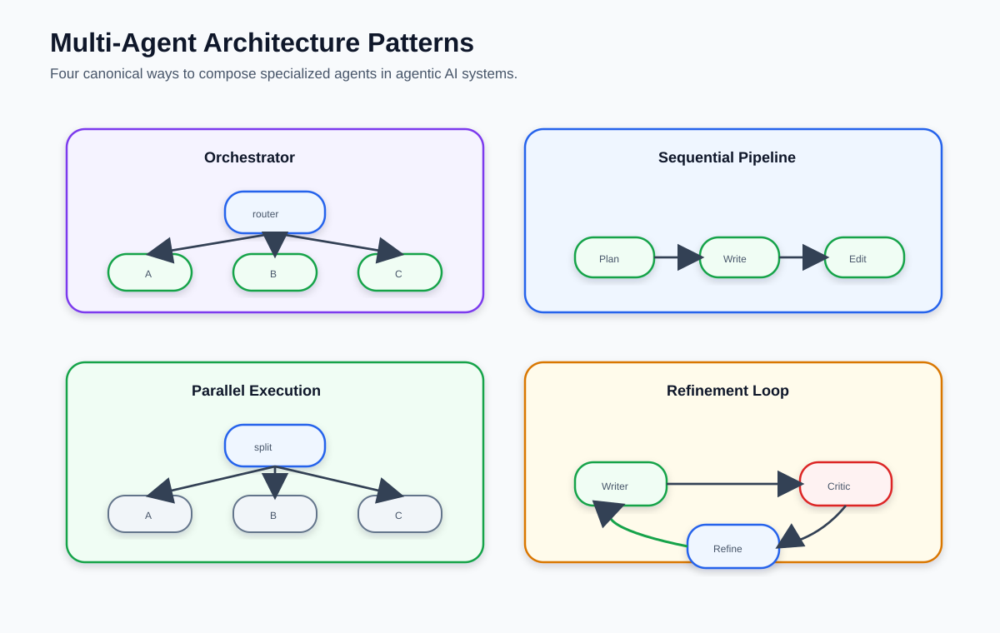

# Sistemas multi-agente: patrones de composición

> Un solo agente puede razonar, buscar y calcular. Pero hay tareas que se benefician
> de distribuir el trabajo entre agentes especializados. Este blog presenta los cuatro
> patrones canónicos para componer sistemas multi-agente y cómo elegir entre ellos.
>
> **8 figuras · lectura ~12 min**

---

## Contenido

1. [Agente monolítico vs sistema multi-agente](#1-agente-monolítico-vs-sistema-multi-agente)
2. [Patrón Orquestador LLM](#2-patrón-orquestador-llm)
3. [Patrón Pipeline Secuencial](#3-patrón-pipeline-secuencial)
4. [Patrón Ejecución Paralela](#4-patrón-ejecución-paralela)
5. [Patrón Loop de Refinamiento](#5-patrón-loop-de-refinamiento)
6. [Mapa de selección de patrones](#6-mapa-de-selección-de-patrones)
7. [Estado compartido entre agentes](#7-estado-compartido-entre-agentes)
8. [Los cuatro patrones de un vistazo](#8-los-cuatro-patrones-de-un-vistazo)

---

## 1. Agente monolítico vs sistema multi-agente

Un agente monolítico hace todo: coordina, investiga, escribe, revisa. Funciona bien para tareas simples, pero tiene límites claros: el contexto crece sin control, los errores en un paso afectan todos los siguientes, y no hay separación entre roles.

Un sistema multi-agente distribuye esas responsabilidades. Cada agente tiene un rol acotado — coordinador, investigador, escritor, revisor — y se comunica con los demás a través de un estado compartido. El resultado es un sistema más modular, depurable y escalable.



> **Cuándo vale la pena el overhead:** la coordinación entre agentes tiene un costo. Un sistema multi-agente se justifica cuando la tarea es suficientemente compleja como para que la especialización y la paralelización compensen ese costo. Para tareas simples, un agente con buenas herramientas es suficiente.

---

## 2. Patrón Orquestador LLM

En el patrón orquestador, un LLM central actúa como coordinador dinámico: recibe la tarea, decide qué agente especializado debe actuar a continuación, interpreta su resultado, y decide el próximo paso. El orquestador no ejecuta trabajo directamente — razona sobre qué agente llamar y en qué orden.

```
Tarea del usuario
      ↓
  Orquestador LLM  ──→  Agente Investigador
       ↑  ↓             Agente Escritor
       │  └──→  Resultado ──→ síntesis final
       └─────────────────────────────────────
```

La fortaleza de este patrón es la **flexibilidad**: el orquestador puede adaptar el flujo según lo que cada agente retorna. Si el investigador no encuentra suficiente información, el orquestador puede pedirle que busque de nuevo antes de pasarle el trabajo al escritor.

La debilidad es la **imprevisibilidad**: el flujo depende de las decisiones del LLM orquestador en cada paso, lo que lo hace difícil de debuggear y de garantizar comportamiento consistente.



> **Implementación en LangGraph:** el orquestador es un nodo que llama al LLM con las descripciones de los agentes disponibles como tools. El router después lee qué tool (agente) seleccionó y enruta al nodo correspondiente.

---

## 3. Patrón Pipeline Secuencial

El pipeline secuencial es el patrón más simple: los agentes se encadenan en orden fijo. Cada agente transforma la salida del anterior y pasa el resultado al siguiente. No hay bifurcaciones ni retroalimentación — el flujo siempre avanza.

```
Agente 1          Agente 2          Agente 3
(crea outline) →  (genera draft) →  (revisa output)
    Step 1            Step 2            Step 3
```

Es el patrón adecuado cuando el problema se descompone naturalmente en etapas ordenadas donde cada etapa depende del resultado de la anterior. Ejemplos típicos: investigación → borrador → revisión → publicación; extracción → transformación → carga.

La limitación es que **no puede iterar**: si el revisor encuentra un problema grave, no hay mecanismo para volver al escritor. Para eso existe el patrón de refinamiento.



> **Implementación en LangGraph:** cada agente es un nodo. Los edges son todos incondicionales: `START → agente1 → agente2 → agente3 → END`. El estado acumula los artefactos intermedios de cada paso.

---

## 4. Patrón Ejecución Paralela

Cuando la tarea se puede descomponer en subtareas **independientes entre sí**, ejecutarlas en paralelo reduce el tiempo total. Un coordinador divide el trabajo, los agentes especializados lo ejecutan concurrentemente, y un agregador sintetiza los resultados.

```
               ┌── Agente A (subtarea 1) ──┐
Coordinador ──→├── Agente B (subtarea 2) ──├──→ Agregador → resultado final
               └── Agente C (subtarea 3) ──┘
```

Ejemplos: analizar tres documentos simultáneamente, buscar información en tres fuentes distintas, generar variantes de un texto en paralelo para luego seleccionar la mejor.

La condición necesaria es que las subtareas sean **verdaderamente independientes**: si el agente B necesita el resultado del agente A para trabajar, el pipeline secuencial es el patrón correcto.



> **Implementación en LangGraph:** LangGraph soporta fan-out nativo. Un nodo puede devolver múltiples actualizaciones de estado que LangGraph despacha a nodos paralelos. El nodo agregador se activa cuando todos los nodos paralelos han completado.

---

## 5. Patrón Loop de Refinamiento

El loop de refinamiento introduce retroalimentación: un agente produce un artefacto, un crítico lo evalúa, y un refinador lo mejora basándose en esa crítica. El ciclo se repite hasta que el crítico aprueba la calidad o se alcanza un número máximo de iteraciones.

```
               ┌─────────────────────────────────┐
               │                                 │
Tarea → Escritor → Artefacto → Crítico → ¿OK? ──┘ (si no) → Refinador
                                           │
                                           └──→ (si sí) → resultado final
```

Es el patrón para tareas donde la calidad importa más que la velocidad y donde los criterios de calidad se pueden expresar como instrucciones para el crítico: precisión factual, tono, formato, cobertura de requisitos.

El riesgo principal es el **loop infinito** o la **oscilación**: el crítico rechaza indefinidamente sin que el refinador pueda satisfacerlo. Siempre se necesita un límite de iteraciones y un criterio de salida por timeout.



> **Implementación en LangGraph:** el router después del crítico inspecciona su evaluación: si aprueba devuelve `"__end__"`, si rechaza devuelve `"refiner"`. El `recursion_limit` del grafo actúa como límite de seguridad.

---

## 6. Mapa de selección de patrones

Ningún patrón es universalmente mejor. La elección depende de tres dimensiones:

- **Descomponibilidad / independencia de subtareas** — ¿se puede partir la tarea en piezas que no se necesitan entre sí?
- **Incertidumbre en el flujo** — ¿sabes de antemano el orden de pasos o depende de los resultados?
- **Requisitos de calidad** — ¿necesitas iteración y crítica, o una pasada es suficiente?



Como guía rápida:

| Situación | Patrón recomendado |
|---|---|
| Pasos ordenados con dependencias claras | Pipeline secuencial |
| Subtareas independientes, velocidad importa | Ejecución paralela |
| Flujo incierto, decisiones dinámicas | Orquestador LLM |
| Calidad crítica, criterios evaluables | Loop de refinamiento |
| Combinación de lo anterior | Híbrido (patrones anidados) |

> **Los patrones se pueden anidar.** Un sistema real suele combinarlos: un orquestador que despacha a un pipeline secuencial para algunas tareas y a un loop de refinamiento para otras.

---

## 7. Estado compartido entre agentes

Independientemente del patrón, todos los agentes de un sistema multi-agente se comunican a través de un **estado compartido**. Ese estado no es solo la lista de mensajes — puede incluir artefactos intermedios, scores de calidad, restricciones, outputs de herramientas, y cualquier dato que un agente necesite que otro haya producido.

El diseño del estado es una decisión de arquitectura crítica:

- **Demasiado estrecho:** los agentes no tienen acceso a contexto que necesitan, producen resultados desconectados.
- **Demasiado amplio:** el estado crece sin control, todos los agentes tienen acceso a todo, y el sistema se vuelve difícil de razonar.

En LangGraph, el estado se define como un `TypedDict`. Cada campo es una decisión de diseño: ¿qué información necesita persistir entre nodos? ¿qué puede cada nodo leer y escribir?

```python
class MultiAgentState(TypedDict):
    messages: list          # historial de conversación
    research: str           # output del agente investigador
    draft: str              # borrador del escritor
    critique: str           # feedback del crítico
    iteration: int          # contador de refinamientos
    approved: bool          # señal de salida del loop
```



> **Regla práctica:** cada campo del estado debe tener un propietario claro — el nodo que lo escribe — y un consumidor claro — el nodo que lo lee. Si un campo no tiene consumidor, sobra. Si un nodo necesita un campo que nadie escribe, falta un agente o un paso.

---

## 8. Los cuatro patrones de un vistazo

La figura final es una vista de conjunto de los cuatro patrones canónicos como referencia rápida.



---

## Resumen

| Patrón | Flujo | Fortaleza | Limitación |
|---|---|---|---|
| **Orquestador LLM** | Dinámico, decidido en runtime | Adaptable, flexible | Impredecible, difícil de debuggear |
| **Pipeline secuencial** | Fijo, paso a paso | Simple, determinista | No itera, no bifurca |
| **Ejecución paralela** | Concurrente, fan-out/fan-in | Velocidad, escalabilidad | Solo para subtareas independientes |
| **Loop de refinamiento** | Cíclico, con criterio de salida | Alta calidad | Riesgo de loop infinito |

### Dónde encaja en la serie

Este blog cierra el arco de los agentes:

```
part01 — agente from scratch (loop manual)
part02 — agente LangGraph (grafo simple)
part03 — sistemas multi-agente (composición de agentes)
```

En el siguiente notebook implementarás los cuatro patrones en código usando LangGraph, empezando por el pipeline secuencial y terminando con un sistema híbrido que combina orquestador y loop de refinamiento.

---

*Figuras generadas para el módulo de Agentes — SI7011 Deep Learning / MCDA · EAFIT*
